# Thesis Management System

Develop an integrated information system prototype for efficiently managing the thesis workshops for Systems Engineering, facilitating the administration of registrations, tutor assignments, proposal reviews, and student progress tracking.

## Table of Contents

  
Click to expand

- [Project Description](#project-description)
  - [Inform and Create News](#inform-and-create-news)
  - [Library Search Tool](#library-search-tool)
  - [Tutor Management](#tutor-management)
  - [Teacher Registration Management](#teacher-registration-management)
  - [Student Registration Management](#student-registration-management)
  - [Dropout and Withdrawal Management](#dropout-and-withdrawal-management)
  - [Thesis Proposal Review](#thesis-proposal-review)
  - [Tutor and Reviewer Assignment](#tutor-and-reviewer-assignment)
  - [Task Management and Progress Tracking](#task-management-and-progress-tracking)
  - [Final Document Generation](#final-document-generation)
  - [User Management](#user-management)
- [Initial Problems and Requirements](#initial-problems-and-requirements)
- [Preliminary Analysis](#preliminary-analysis)
  - [University Overview](#university-overview)
- [Problem Identification and Analysis](#problem-identification-and-analysis)
  - [For Students](#for-students)
  - [For Coordinators](#for-coordinators)
- [Problem Formulation](#problem-formulation)
- [Objectives](#objectives)
  - [General Objective](#general-objective)
  - [Specific Objectives](#specific-objectives)
- [Justification](#justification)
  - [Practical Justification](#practical-justification)
  - [Social Justification](#social-justification)
- [Scope](#scope)
- [Preliminary Project Analysis](#preliminary-project-analysis)
  - [IDF0 Diagram](#idf0-diagram)
- [Solution Proposal](#solution-proposal)
- [Interface Design](#interface-design)
  - [Global](#global)
  - [Students](#students)
  - [Tutors](#tutors)
  - [Coordinators](#coordinators)
  - [Head of Department](#head-of-department)
- [System Videos](#system-videos)
  - [Overview](#overview)
  - [Student Features](#student-features)
  - [Tutor Features](#tutor-features)
  - [Proposal Management and Tutor Assignment](#proposal-management-and-tutor-assignment)
- [Technologies Used](#technologies-used)

### Project Screenshots

1. Home Page with information for students users

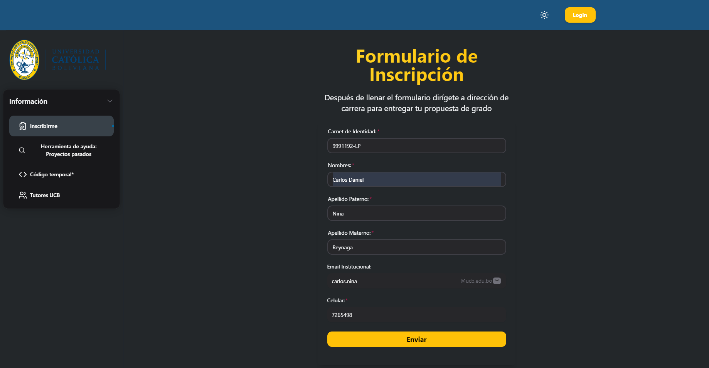

2. News tab for news made by the person in charge of give information to students:

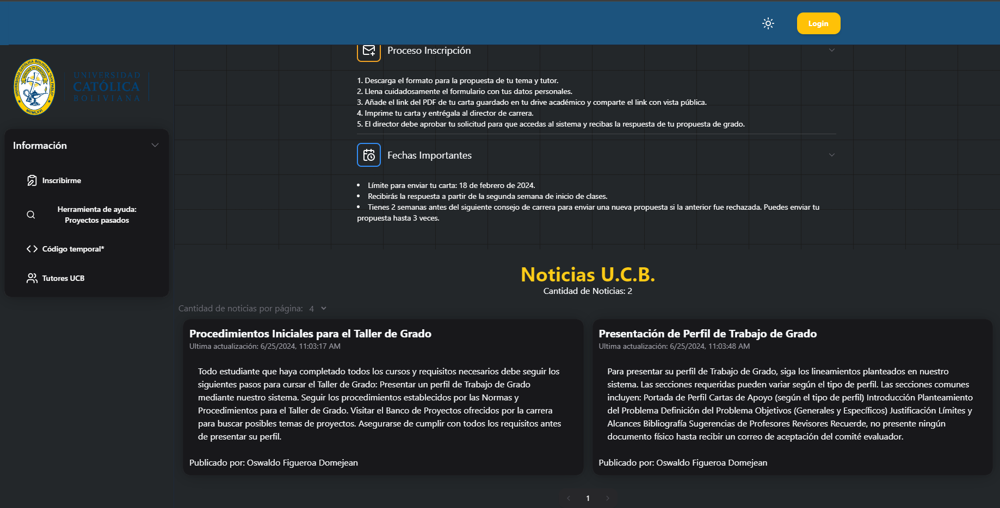

3. Tool for UCB library for searching older thesis projects, grade projects and in various departments, and in the career

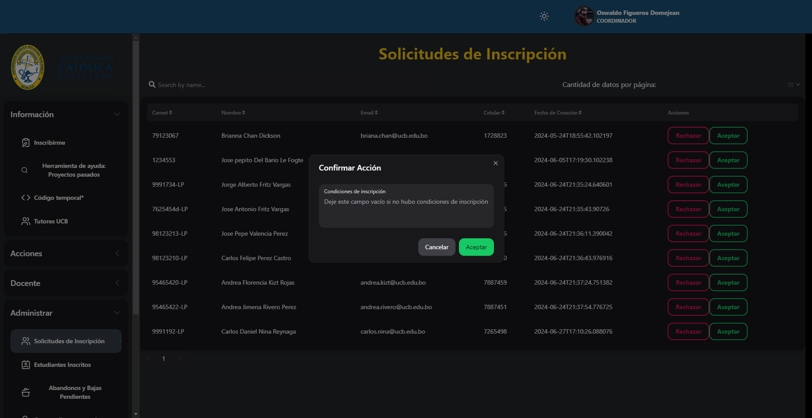

The video shows how to use it manually the library interface for searching older thesis projects, grade projects and in various departments, and in the career

""
Searched result for "Redes Neuronales" in "La Paz" department, Only in the carrera de "SIS"
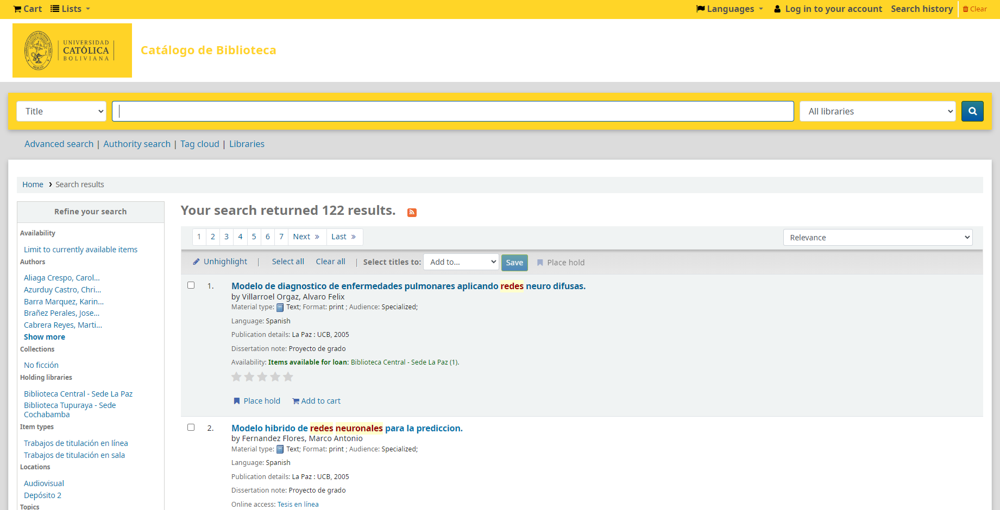

4. Tutors page for students
   A place where a student can find contact information and relevant information about experience that has a tutor, thei can sort and filter by subjects(experience of the professors)

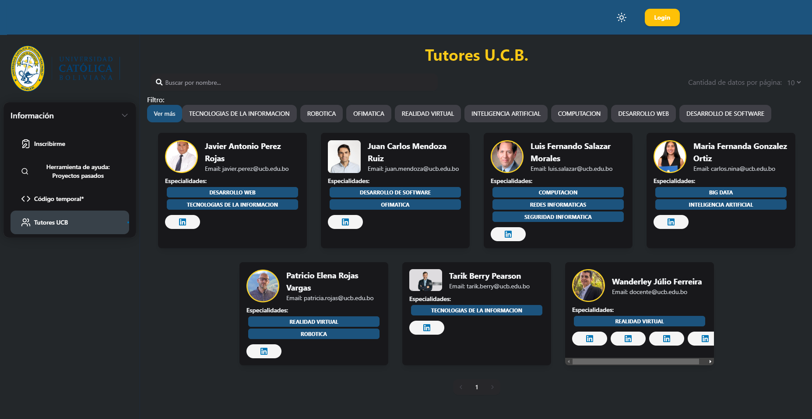

### Filter example:

Filter by subject topic "Robotica"

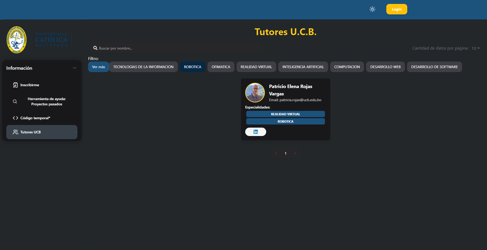

### Sort example:

Search bar:"Jua"

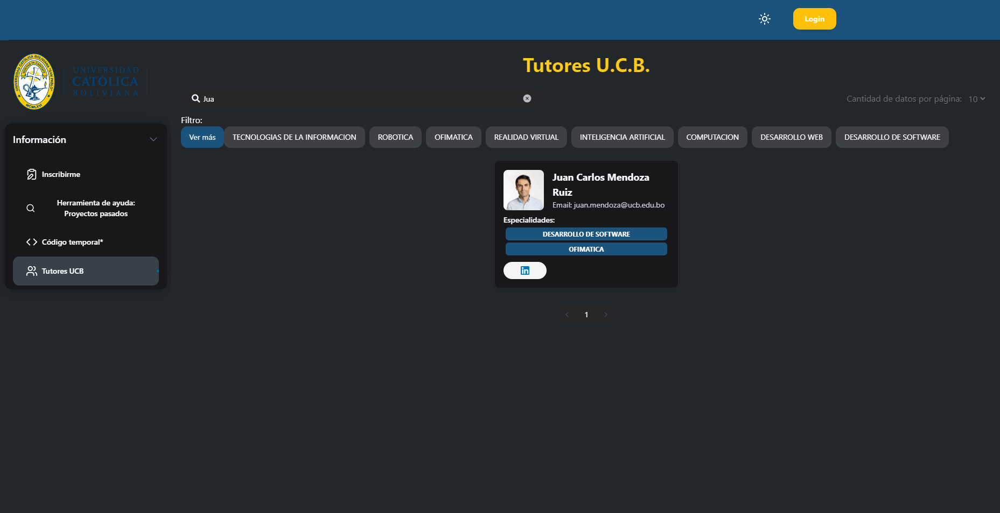

More information if the student clics on a professor
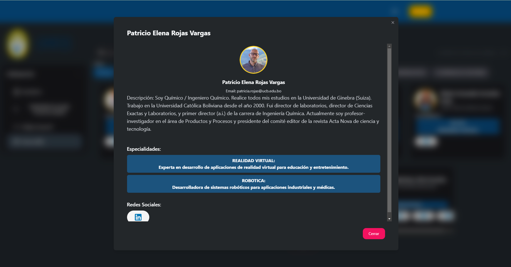
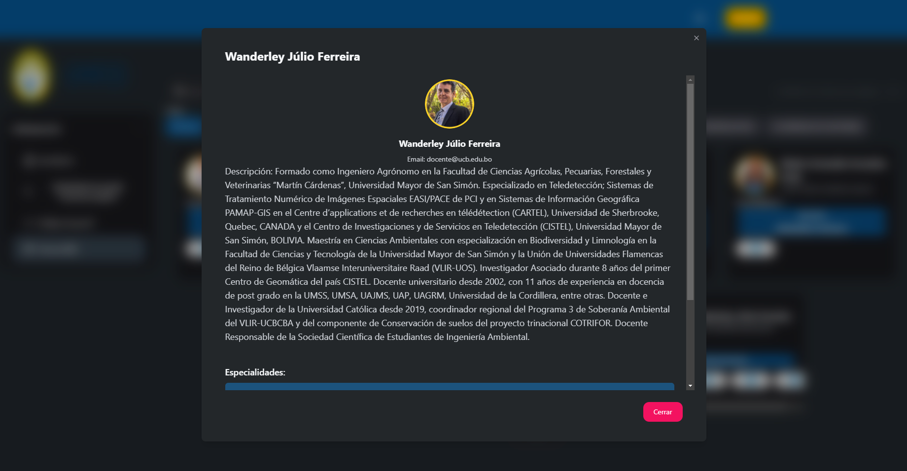

### Admin

### Professor form

1. The professor receive the code in their email
2. He uses in the system and can acces to the form
3. He/She fills the form with their personal information

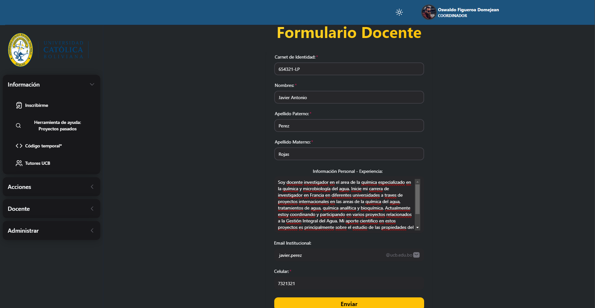

4. He/She receives an email from "tallergradoucb@gmail.com" with their username and autogenerated password

5. 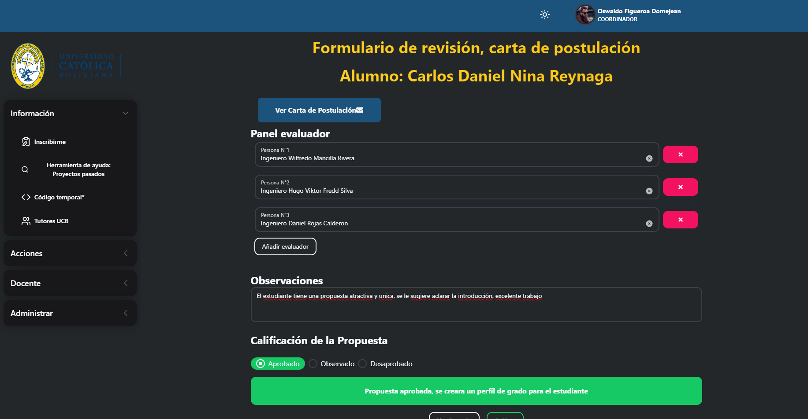

6. After login, He/She can edit their personal information, photo
   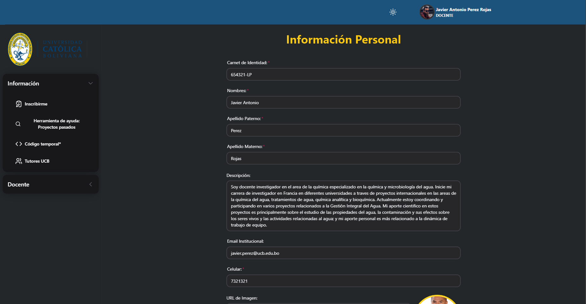
   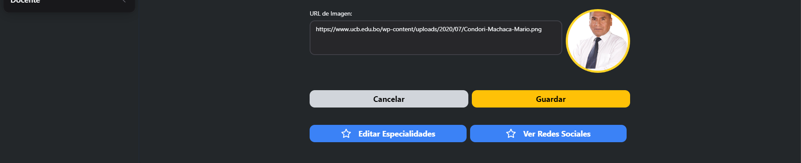

7. He/She can add subjects to their information and write it down some experience about that, it'll be showed to the students that need a tutor for their thesis project
   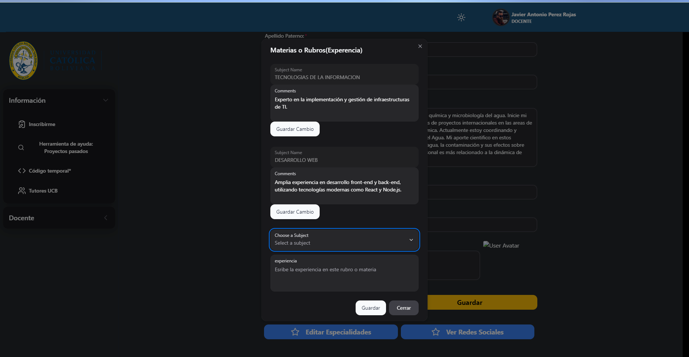

8. He/She can add a lnkedin link for more information for their students, also he can add multiple links if needed

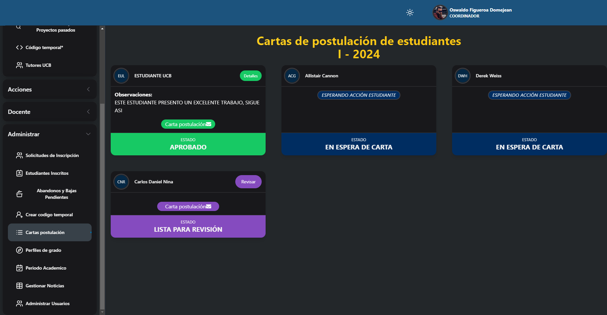

## Project Description

### Inform and Create News

Provides essential information about the thesis process and official documentation. Allows creating and publishing news with any start and end date to inform students about changes or recommendations.

### Library Search Tool

Simple interface to search thesis projects within the department by keywords, authors, topics, with a usage tutorial.

### Tutor Management

Provides information on available tutors, including their experience and contact details to help students choose a tutor.

### Teacher Registration Management

Verifies teacher access through email and two-factor authentication to prevent identity theft.

### Student Registration Management

Students can fill out a registration form reviewed by a teacher to validate if they can take the thesis course. Students can submit project proposals for review and access.

### Dropout and Withdrawal Management

Students can withdraw from the course, and the coordinator can approve or reject withdrawal requests.

### Thesis Proposal Review

Provides interfaces for submitting and reviewing thesis proposals, facilitating feedback between the department council and students.

### Tutor and Reviewer Assignment

Helps the thesis coordinator assign tutors and reviewers to students.

### Task Management and Progress Tracking

Enables virtual or in-person meetings between students and tutors, task assignments, progress tracking, and feedback with grades.

### Final Document Generation

Facilitates the generation of the final document for formal defense.

### User Management

Allows managing users, changing roles, and deregistering students.

## Initial Problems and Requirements

The project was initiated with a document of few requirements, later expanded with additional requirements obtained through interviews with the director of the department, thesis workshop coordinator, and associated teachers. We used JIRA for task management and project tracking.

## Preliminary Analysis

### University Overview

The Bolivian Catholic University “San Pablo” offers nine modalities of graduation, with the most common in Engineering being the project, thesis, directed work, and graduation with excellence. The graduation process has deficiencies in organization, lack of information, and communication.

## Problem Identification and Analysis

### For Students

- Inadequate communication between workshop coordination and topic proposals.
- Lack of proper guides and formats.
- Lack of documentation to support proposals.
- Lack of knowledge about the schedule and tutor availability.

### For Coordinators

- Lack of knowledge about the number of interested students.
- Delayed communication with students.
- Lack of centralized record of proposals.
- Delays in issuing results of council meetings.
- Rudimentary student tracking (Excel sheets).
- Difficulty generating statistics.

## Problem Formulation

**How can the management and control of graduation modalities in the Systems Engineering department be improved?**

## Objectives

### General Objective

Develop an information system focused on managing graduation modalities to automate the necessary processes.

### Specific Objectives

1. Identify necessary roles for restricted access to sensitive information.
2. Develop a module for proposal registration and its requirements.
3. Design a module for the evaluation of proposals and documentation by teachers.
4. Generate a schedule modifiable by teachers for the presentation of documentation.
5. Expose statistics on students and modalities.

## Justification

### Practical Justification

The system will improve the organization of graduation modalities by centralizing documentation and facilitating communication between students, teachers, and tutors.

### Social Justification

It will provide convenience to teachers by centralizing documentation in one place and allow students to view submission dates and receive effective feedback.

## Scope

1. Web platform accessible from different devices.
2. Real-time visibility of documentation status.
3. Record of comments and feedback.
4. Visualization of statistics through graphs.
5. Data download capabilities.
6. Generation of a schedule with submission dates.
7. Early alert notifications to students.

## Preliminary Project Analysis

### IDF0 Diagram

1. **Inputs**: Data and proposals from the student for registration.
2. **Subjects**: Students, teachers, and tutors.
3. **Outputs**: Tutor assignment, schedule visualization, and statistics.
4. **Controls**: University regulations and academic calendar.

## Solution Proposal

Develop an information system for managing graduation work with specific roles (student, teacher, tutor). The system will allow registrations, proposal registration, document tracking, statistics generation, and more.

## Interface Design

### Global

1. Navigation map for global users.
2. Visualization of past project statistics.
3. Search for past projects.
4. Registration requirements visualization.
5. Registration and login.

### Students

1. Navigation map for students.
2. Schedule and submission details visualization.
3. Submission of deliverables and personal data modification.

### Tutors

1. Navigation map for tutors.
2. Session control and record.
3. Schedule and requirements visualization.
4. Student statistics and feedback on deliverables.

### Coordinators

1. Navigation map for coordinators.

### Head of Department

1. Navigation map for the head of department.
2. Visualization of finalized project statuses.

## System Videos

### Overview

### Student Features

### Tutor Features

### Proposal Management and Tutor Assignment

## Technologies Used

- **Frontend**:
  
  
  
  

- **Backend**:
  
  

- **Development Tools**:
  
  

This documentation is a summary of the complete project, covering from conceptualization to final implementation, highlighting the objectives, problems, solutions, and functionalities of the system. For a more extensive documentation, technical details, architecture diagrams, installation and usage guides, and a log of problems and solutions encountered during development will be included.
