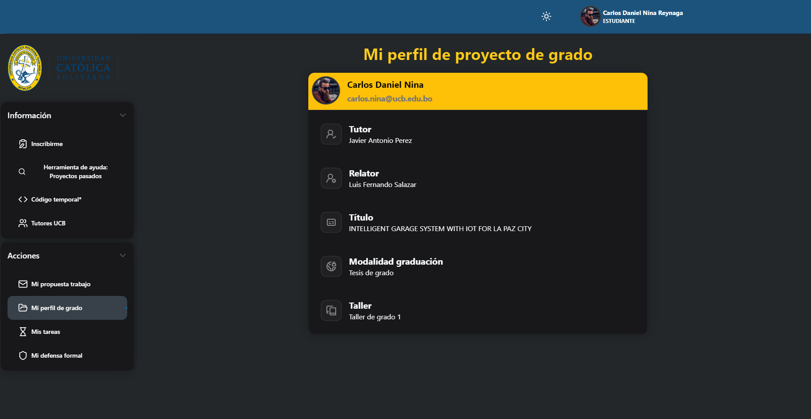
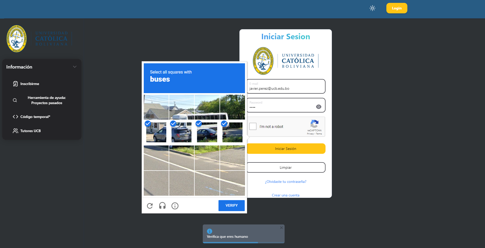

# Thesis Management System

Develop an integrated information system prototype for efficiently managing the thesis workshops for Systems Engineering, facilitating the administration of registrations, tutor assignments, proposal reviews, and student progress tracking.

## Table of Contents

  
Click to expand

- [Project Description](#project-description)
  - [Inform and Create News](#inform-and-create-news)
  - [Library Search Tool](#library-search-tool)
  - [Tutor Management](#tutor-management)
  - [Teacher Registration Management](#teacher-registration-management)
  - [Student Registration Management](#student-registration-management)
  - [Dropout and Withdrawal Management](#dropout-and-withdrawal-management)
  - [Thesis Proposal Review](#thesis-proposal-review)
  - [Tutor and Reviewer Assignment](#tutor-and-reviewer-assignment)
  - [Task Management and Progress Tracking](#task-management-and-progress-tracking)
  - [Final Document Generation](#final-document-generation)
  - [User Management](#user-management)
- [Initial Problems and Requirements](#initial-problems-and-requirements)
- [Preliminary Analysis](#preliminary-analysis)
  - [University Overview](#university-overview)
- [Problem Identification and Analysis](#problem-identification-and-analysis)
  - [For Students](#for-students)
  - [For Coordinators](#for-coordinators)
- [Problem Formulation](#problem-formulation)
- [Objectives](#objectives)
  - [General Objective](#general-objective)
  - [Specific Objectives](#specific-objectives)
- [Justification](#justification)
  - [Practical Justification](#practical-justification)
  - [Social Justification](#social-justification)
- [Scope](#scope)
- [Preliminary Project Analysis](#preliminary-project-analysis)
  - [IDF0 Diagram](#idf0-diagram)
- [Solution Proposal](#solution-proposal)
- [Interface Design](#interface-design)
  - [Global](#global)
  - [Students](#students)
  - [Tutors](#tutors)
  - [Coordinators](#coordinators)
  - [Head of Department](#head-of-department)
- [System Videos](#system-videos)
  - [Overview](#overview)
  - [Student Features](#student-features)
  - [Tutor Features](#tutor-features)
  - [Proposal Management and Tutor Assignment](#proposal-management-and-tutor-assignment)
- [Technologies Used](#technologies-used)

# Project Documentation: Thesis Management System

Develop an integrated information system prototype for efficiently managing the thesis workshops for Systems Engineering, facilitating the administration of registrations, tutor assignments, proposal reviews, and student progress tracking.

## Videos del Sistema

### Video 1: Overview del Sistema

### Video 2: Funcionalidades para Estudiantes

### Video 3: Funcionalidades para Docentes

### Video 4: Gestión de Propuestas y Asignación de Tutores

## Project Screenshots

### 1. Home Page with Information for Student Users

### 2. News Tab for News Made by the Person in Charge of Informing Students

### 3. Tool for UCB Library for Searching Older Thesis Projects, Grade Projects, and in Various Departments and Careers

The video shows how to use the library interface manually for searching older thesis projects, grade projects, and in various departments and careers.

"Searched result for 'Redes Neuronales' in 'La Paz' department, Only in the career of 'SIS'":

### 4. Tutors Page for Students

A place where a student can find contact information and relevant information about the experience of a tutor. They can sort and filter by subjects (experience of the professors).

#### Filter Example: Filter by Subject Topic "Robotica"

#### Sort Example: Search Bar "Jua"

More information if the student clicks on a professor:

### 5. Inscription Process for Students and Evaluation of Proposals

1. After the student has read all the information and prerequisites for inscription, they can fill the inscription form when it is open. (The Coordinator can enable or disable the inscription forms from the system.)

   

2. The student has to talk in person with the coordinator or the career director about their project to see if the project is acceptable regarding technologies and duplicity. With the provided information, there shouldn't be any problem.

3. The student has to submit the project proposal in a letter. The project and the director must accept it.

From the Coordinator or career director's part, they have to accept your request:

They can write any conditions for your case, for special cases and conditions of inscriptions:

The student receives their credentials: username and autogenerated password:

4. After logging into the system, the student can now see the new tab "Mi propuesta de trabajo," where they can upload a link to the drive photo or scan of the letter with a stamp from the coordinator/career director.

   Letter example for "degree workshop proposal":
   
   

   Modal of confirmation for sending the letter:
   

After sending the degree workshop proposal, the student can wait until the response from the meeting of the career director and executives in charge of the review of the proposals.

### Proposal Review

Panel with the proposals of all students:

Reviewing the proposal:

**PD: The proposal has 4 states:**

1. Approved (in this case)
2. Observed
   
3. Rejected
   
4. Ready for review (default state for every proposal)

Coordinator view of all the states:

Modal of confirmation:

New state from the Coordinator's view:

Now they can see in "details" all the important information about the approval of that card:

Now, with the proposal information, the student has a "grade profile":

### Tutor Assignment for the Student

### Reviewer Assignment for the Student

### Title Assignment

### Graduation Mode Assignment

### Final View with All Assigned

### Student View

The student can see the state of their proposal, and if it is approved, they can see their "grade profile":

Rejected student view:

Observed student view:

Sending another proposal letter for review:

All the proposal letters need to have the "Approval" score to be able to have a "grade profile."

## Process for Creating an Account (DOCENTE)

### Admin Part (COORDINADOR)

1. First, the Professor can send their email to the system admin, and the admin writes it down on the "Create temporal code" page.
   

### Professor Part

1. The professor receives the code in their email.
   

2. They use it in the system and can access the form.
   
   

3. They fill out the form with their personal information.
   

4. They receive an email from "tallergradoucb@gmail.com" with their username and autogenerated password.
   
   

5. After login, they can edit their personal information and photo.
   
   

6. They can add subjects to their information and write some experience about that. It will be shown to the students who need a tutor for their thesis project.
   

7. They can add a LinkedIn link for more information for their students. They can also add multiple links if needed.
   

## Project Description

### Inform and Create News

Provides essential information about the thesis process and official documentation. Allows creating and publishing news with any start and end date to inform students about changes or recommendations.

### Library Search Tool

Simple interface to search thesis projects within the department by keywords, authors, topics, with a usage tutorial.

### Tutor Management

Provides information on available tutors, including their experience and contact details to help students choose a tutor.

### Teacher Registration Management

Verifies teacher access through email and two-factor authentication to prevent identity theft.

### Student Registration Management

Students can fill out a registration form reviewed by a teacher to validate if they can take the thesis course. Students can submit project proposals for review and access.

### Dropout and Withdrawal Management

Students can withdraw from the course, and the coordinator can approve or reject withdrawal requests.

### Thesis Proposal Review

Provides interfaces for submitting and reviewing thesis proposals, facilitating feedback between the department council and students.

### Tutor and Reviewer Assignment

Helps the thesis coordinator assign tutors and reviewers to students.

### Task Management and Progress Tracking

Enables virtual or in-person meetings between students and tutors, task assignments, progress tracking, and feedback with grades.

### Final Document Generation

Facilitates the generation of the final document for formal defense.

### User Management

Allows managing users, changing roles, and deregistering students.

## Initial Problems and Requirements

The project was initiated with a document of few requirements, later expanded with additional requirements obtained through interviews with the director of the department, thesis workshop coordinator, and associated teachers. We used JIRA for task management and project tracking.

## Preliminary Analysis

### University Overview

The Bolivian Catholic University “San Pablo” offers nine modalities of graduation, with the most common in Engineering being the project, thesis, directed work, and graduation with excellence. The graduation process has deficiencies in organization, lack of information, and communication.

## Problem Identification and Analysis

### For Students

- Inadequate communication between workshop coordination and topic proposals.
- Lack of proper guides and formats.
- Lack of documentation to support proposals.
- Lack of knowledge about the schedule and tutor availability.

### For Coordinators

- Lack of knowledge about the number of interested students.
- Delayed communication with students.
- Lack of centralized record of proposals.
- Delays in issuing results of council meetings.
- Rudimentary student tracking (Excel sheets).
- Difficulty generating statistics.

## Problem Formulation

**How can the management and control of graduation modalities in the Systems Engineering department be improved?**

## Objectives

### General Objective

Develop an information system focused on managing graduation modalities to automate the necessary processes.

### Specific Objectives

1. Identify necessary roles for restricted access to sensitive information.
2. Develop a module for proposal registration and its requirements.
3. Design a module for the evaluation of proposals and documentation by teachers.
4. Generate a schedule modifiable by teachers for the presentation of documentation.
5. Expose statistics on students and modalities.

## Justification

### Practical Justification

The system will improve the organization of graduation modalities by centralizing documentation and facilitating communication between students, teachers, and tutors.

### Social Justification

It will provide convenience to teachers by centralizing documentation in one place and allow students to view submission dates and receive effective feedback.

## Scope

1. Web platform accessible from different devices.
2. Real-time visibility of documentation status.
3. Record of comments and feedback.
4. Visualization of statistics through graphs.
5. Data download capabilities.
6. Generation of a schedule with submission dates.
7. Early alert notifications to students.

## Preliminary Project Analysis

### IDF0 Diagram

1. **Inputs**: Data and proposals from the student for registration.
2. **Subjects**: Students, teachers, and tutors.
3. **Outputs**: Tutor assignment, schedule visualization, and statistics.
4. **Controls**: University regulations and academic calendar.

## Solution Proposal

Develop an information system for managing graduation work with specific roles (student, teacher, tutor). The system will allow registrations, proposal registration, document tracking, statistics generation, and more.

## Interface Design

### Global

1. Navigation map for global users.
2. Visualization of past project statistics.
3. Search for past projects.
4. Registration requirements visualization.
5. Registration and login.

### Students

1. Navigation map for students.
2. Schedule and submission details visualization.
3. Submission of deliverables and personal data modification.

### Tutors

1. Navigation map for tutors.
2. Session control and record.
3. Schedule and requirements visualization.
4. Student statistics and feedback on deliverables.

### Coordinators

1. Navigation map for coordinators.

### Head of Department

1. Navigation map for the head of department.
2. Visualization of finalized project statuses.

## System Videos

### Overview

### Student Features

### Tutor Features

### Proposal Management and Tutor Assignment

## Technologies Used

- **Frontend**:
  
  
  
  

- **Backend**:
  
  

- **Development Tools**:
  
  

This documentation is a summary of the complete project, covering from conceptualization to final implementation, highlighting the objectives, problems, solutions, and functionalities of the system. For a more extensive documentation, technical details, architecture diagrams, installation and usage guides, and a log of problems and solutions encountered during development will be included.
